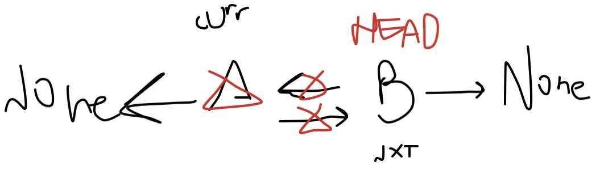
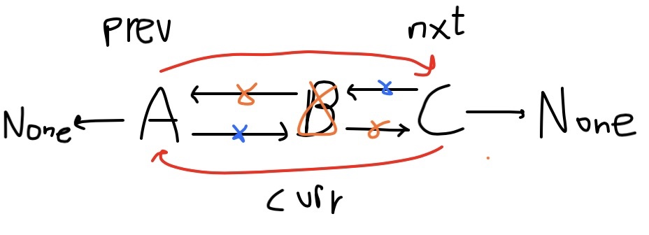
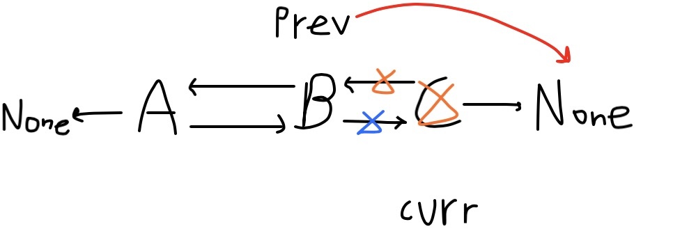

💡 The doubly linked list is very similar to the singly linked list except for the difference of the previous pointer. In a doubly linked list, a node is made up of the following components.

* **Data**
* **Next** (Points to the next node)
* **Prev** (Points to the previous node)

\* The prev of the head node points to NULL while the next of the tail node also points to NULL.

```python
class Node:
    def __init__(self, data):
        self.data = data
        self.next = None
        self.prev = None

class DoublyLinkedList:
    def __init__(self):
        self.head = None
    
    def append(self, data):
        pass
    
    def prepend(self, data):
        pass
    
    def print_list(self):
        pass    
```

append
------

1\. The doubly linked list is empty.

2\. The doubly linked list is not empty.

```python
def append(self, data):
    if self.head is None:
        new_node = Node(data)
        new_node.prev = None
        self.head = new_node
    else:
        new_node = Node(data)
        curr = self.head
        while curr:
            curr = curr.next
        curr.next = new_node
        new_node.prev = curr
        new_node.next = None
```

print\_list
-----------

```python
def print_list(self):
    curr = self.head
    while curr:
        print(curr.data)
        curr = curr.next
```

prepend
-------

```python
def prepend(self, data):
    if self.head is None:
        new_node = Node(data)
        new_node.prev = None
        self.head = new_node
    else:
        new_node = Node(data)
        self.head.prev = new_node
        new_node.next = self.head
        self.head = new_node
        new_node.prev = None
```

Add Node After
---------------

1\. The node that we have to insert after the new node is the last node in the doubly linked list so that the next of that node is NULL. We will call the **append** method, to insert a node after this node.

2\. The node that we have to insert after the new node is not the last node in the doubly linked list.

```python
def add_after_node(self, key, data):
    curr = self.head
    while curr:
        if curr.next is None and curr.data == key:
            self.append(data)
            return
        elif curr.data == key:
            new_node = Node(data)
            nxt_tmp = curr.next
            curr.next = new_node
            new_node.next = nxt_tmp
            nxt_tmp.prev = new_node
            new_node.prev = curr
            return
        curr = curr.next
```

Add Node Before
---------------

```python
def add_before_node(self, key, data):
        curr = self.head
        while curr:
            if curr.next is None and curr.data == key:
                self.prepend(data)
                return
            elif curr.data == key:
                new_node = Node(data)
                prev_tmp = curr.prev
                prev_tmp.next = new_node
                curr.prev = new_node
                new_node.next = curr
                new_node.prev = prev_tmp
                return
            curr = curr.next
            # FIX: Does not work when 
            # Adding node before last node
```

Delete Node
-----------

1\. Deleting the only node present

2\. Deleting Head Node

3\. Deleting node other than head where **curr.next** is not **None**

4\. Deleting node other than head where **curr.next** is **None **(deleting last node)

```python
# Case 1: Deleting only node present
def delete(self, key):
    curr = self.head
    while curr:
        if curr.data == key and curr == self.head:
            # 1.
            if not curr.next:
                curr = None
                self.head = None
                return
        curr = curr.next
```

```python
# Case 2: Deleting Head Node
def delete(self, key):
    curr = self.head
    while curr:
        if curr.data == key and curr == self.head:
            # 1.
            if not curr.next:
                curr = None
                self.head = None
                return
            # 2.
            else:
                nxt = curr.next
                curr.next = None
                nxt.prev = None
                curr = None
                self.head = nxt
                return
        curr = curr.next

"""
Example: None<- A <-> B -> None
nxt = B
curr.next = None   (A-> None)
nxt.prev = None    (None <-B)
curr = None        (A = None)
self.head = nxt    (None <-B-> None) (B is HEAD)
... else continue traversing.
"""
```



```python
# Case 3: Deleting node other than head where curr.next is not None
def delete(self, key):
    curr = self.head
    while curr:
        if curr.data == key and curr == self.head:
            # 1.
            if not curr.next:
                curr = None
                self.head = None
                return
            # 2.
            else:
                nxt = curr.next
                curr.next = None
                nxt.prev = None
                curr = None
                self.head = nxt
                return
        elif curr.data == key:
            # 3.
            if curr.next:
                nxt = curr.next
                prev = curr.prev
                prev.next = nxt
                nxt.prev = prev
                curr.next = None
                curr.prev = None
                curr = None
                return
        curr = curr.next
```



```python
# Case 4: Deleting node other than head where curr.next is None (deleting last node)
def delete(self, key):
    curr = self.head
    while curr:
        if curr.data == key and curr == self.head:
            # 1.
            if not curr.next:
                curr = None
                self.head = None
                return
            # 2.
            else:
                nxt = curr.next
                curr.next = None
                nxt.prev = None
                curr = None
                self.head = nxt
                return
        elif curr.data == key:
            # 3.
            if curr.next:
                nxt = curr.next
                prev = curr.prev
                prev.next = nxt
                nxt.prev = prev
                curr.next = None
                curr.prev = None
                curr = None
                return
            if not curr.next:
                prev = curr.prev
                prev.next = None
                curr.prev = None
                curr = None
                return
        curr = curr.next
```



Reverse
-------

💡 To reverse a doubly linked list, we need to switch the **next** and the **previous** pointers of every node. Also, we need to switch the last node with the head node of the linked list.

```python
def reverse(self):
    tmp = None
    curr = self.head
    while curr:
        tmp = curr.prev
        curr.prev = curr.next
        curr.next = tmp
        curr = curr.prev
    if tmp:
        self.head = tmp.prev
```

Remove Duplicates
-----------------

None\<-**1**\<-\>**4**\<-\>**7**\<-\>**4**-\>None

```python
def remove_duplicates(self):
    cur = self.head 
    seen = dict()
    while cur:
        if cur.data not in seen:
            seen[cur.data] = 1
            cur = cur.next
        else:
            nxt = cur.next
            self.delete_node(cur)
            cur = nxt
```

Complete Code
-------------

```python
class Node:
    def __init__(self, data):
        self.data = data
        self.next = None
        self.prev = None


class DoublyLinkedList:
    def __init__(self):
        self.head = None

    def append(self, data):
        if self.head is None:
            new_node = Node(data)
            new_node.prev = None
            self.head = new_node
        else:
            new_node = Node(data)
            cur = self.head
            while cur.next:
                cur = cur.next
            cur.next = new_node
            new_node.prev = cur
            new_node.next = None

    def prepend(self, data):
        if self.head is None:
            new_node = Node(data)
            new_node.prev = None
            self.head = new_node
        else:
            new_node = Node(data)
            self.head.prev = new_node
            new_node.next = self.head
            self.head = new_node
            new_node.prev = None

    def print_list(self):
        curr = self.head
        while curr:
            print(curr.data)
            curr = curr.next
            
    def add_after_node(self, key, data):
        curr = self.head
        while curr:
            if curr.next is None and curr.data == key:
                self.append(data)
                return
            elif curr.data == key:
                new_node = Node(data)
                nxt_tmp = curr.next
                curr.next = new_node
                new_node.next = nxt_tmp
                nxt_tmp.prev = new_node
                new_node.prev = curr
                return
            curr = curr.next
            
    def add_before_node(self, key, data):
        curr = self.head
        while curr:
            if curr.next is None and curr.data == key:
                self.prepend(data)
                return
            elif curr.data == key:
                new_node = Node(data)
                prev_tmp = curr.prev
                prev_tmp.next = new_node
                curr.prev = new_node
                new_node.next = curr
                new_node.prev = prev_tmp
                return
            curr = curr.next

    def delete(self, key):
        curr = self.head
        while curr:
            if curr.data == key and curr == self.head:
                # 1.
                if not curr.next:
                    curr = None
                    self.head = None
                    return
                # 2.
                else:
                    nxt = curr.next
                    curr.next = None
                    nxt.prev = None
                    curr = None
                    self.head = nxt
                    return
            elif curr.data == key:
                # 3.
                if curr.next:
                    nxt = curr.next
                    prev = curr.prev
                    prev.next = nxt
                    nxt.prev = prev
                    curr.next = None
                    curr.prev = None
                    curr = None
                    return
                if not curr.next:
                    prev = curr.prev
                    prev.next = None
                    curr.prev = None
                    curr = None
                    return
            curr = curr.next
    
    def delete_node(self, node):
        cur = self.head
        while cur:
            if cur == node and cur == self.head:
              # Case 1:
                if not cur.next:
                    cur = None 
                    self.head = None
                    return

                # Case 2:
                else:
                    nxt = cur.next
                    cur.next = None 
                    nxt.prev = None
                    cur = None
                    self.head = nxt
                    return 

            elif cur == node:
              # Case 3:
                if cur.next:
                    nxt = cur.next 
                    prev = cur.prev
                    prev.next = nxt
                    nxt.prev = prev
                    cur.next = None 
                    cur.prev = None
                    cur = None
                    return

              # Case 4:
                else:
                    prev = cur.prev 
                    prev.next = None 
                    cur.prev = None 
                    cur = None 
                    return 
            cur = cur.next
        
    def remove_duplicates(self):
        cur = self.head 
        seen = dict()
        while cur:
            if cur.data not in seen:
                seen[cur.data] = 1
                cur = cur.next
            else:
                nxt = cur.next
                self.delete_node(cur)
                cur = nxt
                
    def pairs_with_sum(self, sum_val):
        pairs = list()
        p = self.head
        q = None
        while p:
            q = p.next
            while q:
                if (p.data + q.data) == sum_val:
                    pairs.append("(" + str(p.data) + "," + \
                                 str(q.data) + ")")
                q = q.next
            p = p.next
        return pairs
```