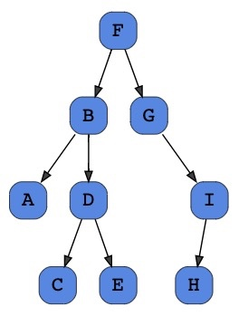

💡 A **binary tree** is a tree data structure in which each node has at most two children, which are referred to as the *left child* and the *right child*.

```python
class Node:
    def __init__(self, value):
        self.value = value
        self.left = None
        self.right = None
```

```python
class BinaryTree:
    def __init__(self, root):
        self.root = Node(root)
```

Traversals
----------

* Pre-order
* In-order
* Post-order

### Pre-order

1\. Check is the current node is empty / null.

2\. Display the data part of the root (or current node).

3\. Traverse the left subtree by recursively calling the pre-order method.

4\. Traverse the right subtree by recursively calling the pre-order method.

 

### F, B, A, D, C, E, G, I, H

```python
def preorder_print(self, start, traversal):
    """Root -> Left -> Right"""
    if start:
        traversal += (str(start.value) + "-")
        traversal = self.preorder_print(start.left, traversal)
        traversal = self.preorder_print(start.right, traversal)
    return traversal
```

### In-order

1\. Check if the current node is empty / null.

2\. Traverse the left subtree by recursively calling the in-order method.

3\. Display the data part of the root (or the current node).

4\. Traverse the right subtree by recursively calling the in-order method.

 

### A, B, C, D, E, F, G, H, I

```python
def inorder_print(self, start, traversal):
    """Left -> Root -> Right"""
    if start:
        traversal = self.inorder_print(start.left, traversal)
        traversal += (str(start.value) + "-")
        traversal = self.inorder_print(start.right, traversal)
    return traversal
```

### Post-order

1\. Check if the current node is empty / null.

2\. Traverse the left subtree by recursively calling the post-order method

3\. Traverse the right subtree by recursively calling the post-order method

4\. Display the data part of the root (or current node)


### A, C, E, D, B, H, I, G, F

```python
def postorder_print(self, start, traversal):
    """Left -> Right -> Root"""
    if start:
        traversal = self.postorder_print(start.left, traversal)
        traversal = self.postorder_print(start.right, traversal)
        traversal += (str(start.value) + "-")
    return traversal
```

### Helper to Print Tree

```python
def print_tree(self, traversal_type):
    if traversal_type == "preorder":
        return self.preorder_print(tree.root, "")
    elif traversal_type == "inorder":
        return self.inorder_print(tree.root, "")
    elif traversal_type == "postorder":
        return self.postorder_print(tree.root, "")
        
    else:
        print(f'Traversal type {traversal_type} is not supported.')
        return False
```

Level Order Traversal
=====================

To do a level-order traversal of a binary tree, we require a **Queue**.

```python
class Queue:
    def __init__(self):
        self.items = []
        
    def is_empty(self):
        return self.items == []
        
    def enqueue(self, item):
        self.items.insert(0, item)
    
    def dequeue(self):
        if not self.is_empty():
            return self.items.pop()
    
    def peek(self):
        if not self.is_empty():
            return self.items[-1]
    
    def size(self):
        return len(self.items)
    
    def __len__(self):
        return self.size()
            
```

```python
def levelorder_print(self, start):
    if start is None:
        return
    queue = Queue()
    queue.enqueue(start)
    
    traversal = ""
    while len(queue) > 0:
        traversal += str(queue.peek()) + "-"
        node = queue.dequeue()
        
        if node.left:
            queue.enqueue(node.left)
        if node.right:
            queue.enqueue(node.right)
    
    return traversal
```

```python
# Solution 2. Valid for bst_practice.py
from typing import List
def levelorder_queue(self) -> List[int]:
    if self.is_empty():
        return
    queue = Queue()
    queue.enqueue(self)
    traversal = []
    while len(queue) > 0:
        if queue.peek()._root:
            traversal.append(queue.peek()._root)
        node = queue.dequeue()
        if node._left._root is not None:
            queue.enqueue(node._left)
        if node._right._root is not None:
            queue.enqueue(node._right)
    return traversal
```

Reverse Level Order Traversal
-----------------------------

To solve this we’ll make use of a queue again, (we’ll enqueue the right child before the left child. And we will use a **stack**.

```python
# Solution valid for bst_practice.py
def reverse_level_order(self) -> str:
    if self.is_empty():
        return
    queue = Queue()
    stack = Stack()
    queue.enqueue(self)
    traversal = []
    while len(queue) > 0:
        node = queue.dequeue()
        stack.push(node)
        if node._right._root:
            queue.enqueue(node._right)
        if node._left._root:
            queue.enqueue(node._left)
    while len(stack) > 0:
        node = stack.pop()
        traversal.append(node._root)
    return traversal
```

Calculating the Height of a Binary Tree
---------------------------------------


